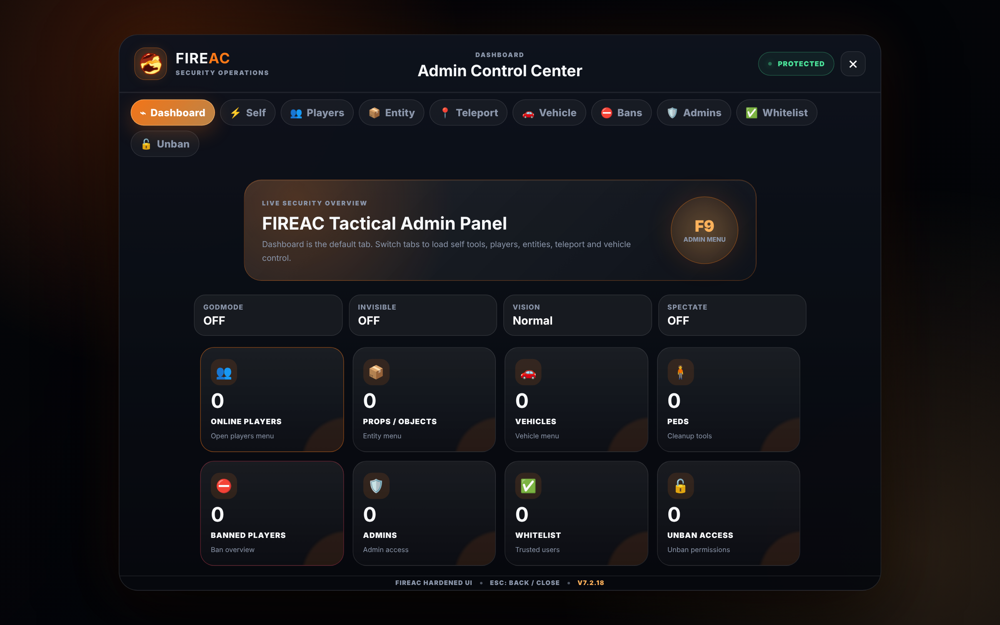

# FIREAC — version BREACH RP

Version **modifiée** de [FIREAC](https://github.com/AmirrezaJaberi/FIREAC) (Amirreza Jaberi), utilisée sur le serveur FiveM BREACH RP.
Publiée sous la même licence, **GNU AGPL-3.0** (voir `LICENSE`). Les modifications sont listées dans `BREACH_CHANGES.md`.

Modified version of FIREAC by Amirreza Jaberi, released under the GNU AGPL-3.0. Changes are listed in `BREACH_CHANGES.md`.

> **Sur BREACH, la documentation d'origine ci-dessous ne s'applique pas telle quelle :**
> - **Panneau admin :** il s'ouvre par **F9 > BREACH > Anticheat**. Il n'y a ni touche F9 directe, ni `/fireac`, ni `/fireacmenu`.
> - **Admins :** les admins BREACH (`exports.Breach_Core:IsAdmin`) sont admins FIREAC d'office ; `addadmin` n'est utile que pour quelqu'un qui n'est pas admin BREACH (console du serveur seulement).
> - **Bannir / débannir :** `fireacban [ID] [raison]` et `fireacunban [n° de ban]` pour les admins. Un joueur non admin qui les tape est **banni** (`FIREAC.AdminMenu.MenuPunishment`).
>   `funban` / `unban` demandent en plus l'accès « unban » (`addunban [ID]` depuis la console) : les admins BREACH ne l'ont pas d'office. Depuis la console du serveur, toutes marchent.
> - **Webhooks Discord :** les URLs vont dans `configs/fire-webhook.local.lua` (ignoré par git), jamais dans `configs/fire-webhook.lua`. Modèle : `configs/fire-webhook.local.example.lua`.
> - **Captures d'écran et anti-VPN :** désactivés (`configs/fire-config.lua`) ; `discord-screenshot` n'est pas nécessaire.

---

<h1 align="center">
  
  <b>FIREAC</b>
  
</h1>

<p align="center">
  <b>
    <a href="https://discord.gg/uvccDWtqhv">Discord</a> •
    <a href="https://amirrezajaberi.ir/fireac">Website</a>
  </b>
</p>

### 📢 Advertisement

[Fiveguard.net](https://fiveguard.net/) is best paid FiveM Anticheat providing unique features such as Anti Aimbot, Objects-AI detection, Cheats-AI detection, Safe-Events and many more. This product is developed to eliminate cheats and at the same time provide smooth gaming experience!

<p align='center'>
  For an enhanced <b>paid anticheat</b>, visit <a href="https://store.fiveguard.ac">https://store.fiveguard.ac</a>.
</p>
<p align='center'>
  We are able to provide this <strong>free product</strong> thanks to the support of <a href="https://fiveguard.net">https://fiveguard.net</a>.
</p>
<p align='center'>
  <strong>Fiveguard</strong> - Elevating your FiveM server security.
</p>

<b>FIREAC is a very good free anti-cheat for basic protection. For stronger and more complete protection, purchase <a href="https://fiveguard.net/" rel="dofollow">Fiveguard Premium</a>, which includes advanced systems such as Anti Resource Stopper, Anti Resource Starter, Anti Aimbot, Objects-AI detection, Cheats-AI detection, Safe-Events and more.</b>
---

### 🚀 What is FIREAC?

[FIREAC](https://amirrezajaberi.ir/fireac) is a free and lightweight FiveM anti-cheat created by **Amirreza Jaberi**.  
It provides useful basic client-side and server-side checks while keeping installation and administration simple.

FIREAC works with **ESX**, **QBCore**, and **Standalone** servers. The current version includes improved player lifecycle handling and fixes the previous spawn and incorrect-player punishment problems.

---

### 🖥️ Admin Panel



---

### ⚙️ Requirements

<table align='center'>
  <tr>
    <td align='center'>
      <a href="https://github.com/jaimeadf/discord-screenshot/releases">discord-screenshot</a><br>For taking screenshots
    </td>
    <td align='center'>
      <a href="https://github.com/overextended/oxmysql/releases">oxmysql</a><br>For saving SQL data
    </td>
  </tr>
</table>

---

### 🛡️ Features

<details>
  <summary><b>Client Side Protection</b></summary>

- Anti-Health Hack
- Anti-Armor Hack
- Anti-Infinite Ammo
- Anti-Spectate
- Anti-Infinite Stamina
- Anti-Blacklist Weapon
- Anti-God Mode
- Anti-Noclip
- Anti-Rainbow Vehicle
- Anti-Teleport Vehicle / Ped
- Anti-Invisible
- Anti-Change Speed
- Anti-Free Camera
- Anti-Plate Changer
- Anti-Blacklist Plate
- Anti-Night Vision / Thermal Vision
- Anti-Super Jump
- Anti-Tiny Ped
- Anti-Ped Changer
- Anti-Blacklist Tasks / Animations
- Anti-Pickup Collect
- Anti-Suicide
</details>

<details>
  <summary><b>Server Side Protection</b></summary>

- Anti-Spam Chat
- Anti-Blacklist Commands
- Anti-Weapon Damage Changer
- Anti-Blacklist Word
- Anti-Bring All
- Anti-Blacklist Trigger
- Anti-Spam Trigger
- Anti-Clear Ped Tasks
- Anti-Taze Players
- Anti-Inject
- Anti-Blacklist Explosion
- Anti-Explosion Spam
- Anti-Blacklist Object / Ped / Vehicle
- Anti-Spam Object / Ped / Vehicle
- Anti-Change Permission
- Anti-Play Sound
- Server-Side Admin Menu Authorization
- Server-Validated Ban and Unban Actions
</details>

---

### 📦 Installation

🔗 For full installation guide & step-by-step tutorial, please visit:  
👉 **[FIREAC Documentation](https://docmaker.ir/panel/template/5/2/en/Anti-Cheat-Installation-Guide-for-FIREAC/)**

Start `oxmysql` before FIREAC:

```cfg
ensure oxmysql
ensure FIREAC
```

Import `database.sql` before starting the resource for the first time.

---

### ✅ Whitelist

Manage authorized players, admins, and permissions easily.  
📖 Detailed whitelist guide is available here:  
👉 **[Whitelist Documentation](https://docmaker.ir/panel/template/5/32/en/How-to-add-a-player-to-the-whitelist-in-FIREAC/)**

---

### 🔓 Unban

Use the `/funban [Ban ID]` command for unbanning players.  
📖 Learn more about unban management here:  
👉 **[Unban Documentation](https://docmaker.ir/panel/template/5/12/en/How-to-lift-a-user-ban-in-FIREAC/)**

---

### 👑 Add Admin

Use the `addadmin [ID]` command from the server console to add an administrator.  
Administrators can access the admin panel using `F9`, `/fireac`, or `/fireacmenu`.

📖 Learn more about adding admins here:  
👉 **[Add Admin Documentation](https://docmaker.ir/panel/template/5/22/en/How-to-add-an-admin-to-FIREAC/)**

---

### 📊 Exports

```lua
exports['FIREAC']:FIREAC_ACTION(source, "BAN", "Cheating", "Using godmode")
exports['FIREAC']:FIREAC_CHANGE_TEMP_WHITELIST(source, true, 15000)
exports['FIREAC']:FIREAC_CHECK_TEMP_WHITELIST(source)
```

Server-side ban and unban exports:

```lua
exports['FIREAC']:BanPlayer(playerId, reason, issuer)
exports['FIREAC']:UnbanPlayer(banId, issuer)
```

📖 Full list of exports & examples:  
👉 **[Exports Documentation](https://amirrezajaberi.ir/fireac)**

---

### 📝 Commands

| Command | Description |
| ------- | ----------- |
| `funban [Ban ID]` | Unban a user from the database |
| `unban [Ban ID]` | Unban a user from the database |
| `addadmin [ID]` | Add an administrator with admin-menu access |
| `addwhitelist [ID]` | Add a player to the whitelist |
| `addunban [ID]` | Grant unban access |
| `fireacban [ID] [Reason]` | Ban a player |
| `fireacunban [Ban ID]` | Remove a ban |

📖 Learn all commands with examples:  
👉 **[Commands Documentation](https://amirrezajaberi.ir/fireac)**

---

### 🎓 Tutorial

📖 Complete step-by-step guide available at:  
👉 **[FIREAC Tutorial](https://amirrezajaberi.ir/fireac)**

---

### 📜 License

FIREAC - AGPL-3.0 License  
Copyright © 2022-2026  
Developed by **Amirreza Jaberi**

> This software is free but without any warranty.  
> See the [GNU License](https://www.gnu.org/licenses/) for details.

---
